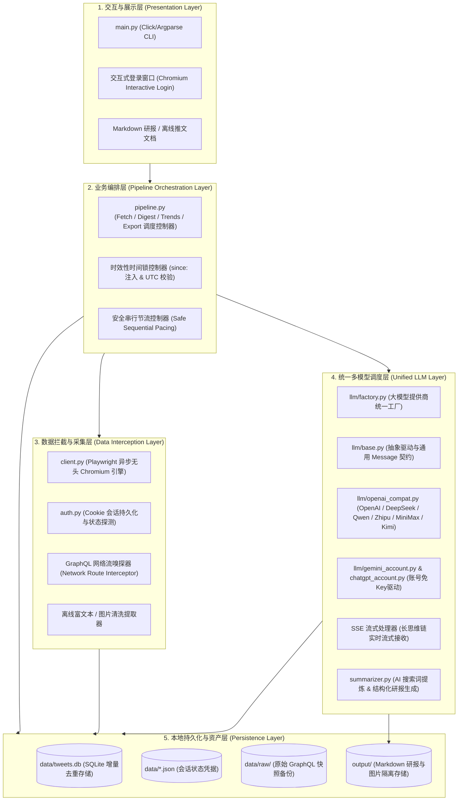
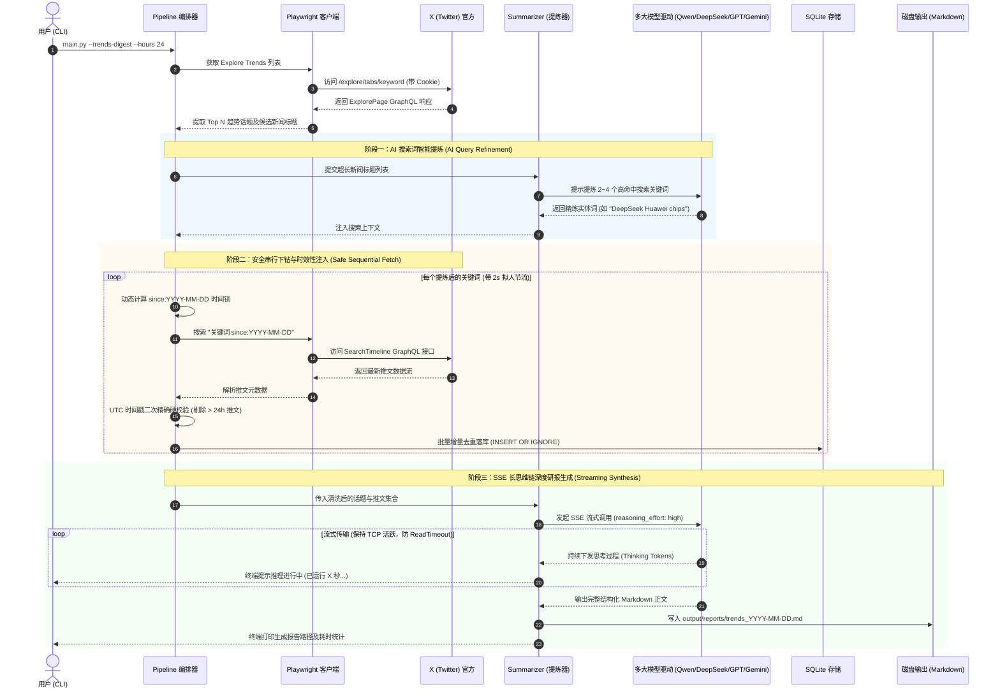
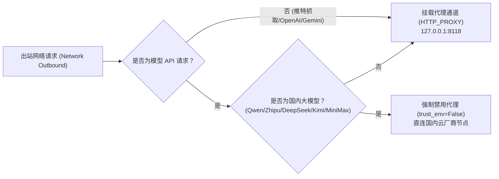

# Xtract 系统总体架构设计文档 (System Architecture Document)

> **文档版本**：v1.0.0  
> **更新时间**：2026-09-27  
> **项目定位**：Xtract - 基于真实浏览器透明网络流拦截的高保真 X（Twitter）全景情报自动化挖掘与多大模型结构化研报系统。

---

## 1. 架构目标与第一性原理

### 1.1 业务背景与系统边界
在海量社交媒体信息流中，X（Twitter）是全球顶尖技术人员、商业领袖与媒体发布第一手突发信息的集散地。然而，平台充斥着情绪水帖、营销广告、长尾旧帖与信息碎片。  
本系统的目标是通过自动化手段打通从「全网热搜/特定关注」到「本地可溯源数据资产」，再到「多大模型深度长思考结构化研报」的情报闭环。

### 1.2 第一性原理设计哲学
1. **解耦「确定性工程」与「非确定性智能」**：
   - 数据抓取、反爬防御、去重存储、时效校验、互动指标过滤属于 100% 确定性工程逻辑，严禁依赖不可控的大模型。
   - 观点聚类、正反方辩证推演、深层因果分析与商业/技术行动选题交给大模型发挥。
2. **抗脆弱性优先（Anti-Fragility）**：
   - 杜绝依赖推特第三方逆向库（其依赖脆弱的 AST 变量逆向提取签名，极易因 X 官方打包混淆升级而猝死）。
   - 采用真实无头浏览器运行官方 JavaScript，以官方网络流监听器（Network Interception）在协议层捕获合法 GraphQL 响应。
3. **系统承担复杂性，用户触碰极简丝滑**：
   - 用户无需使用开发者工具（F12）查抓 Token；
   - 针对长达数分钟的深度推理，采用 SSE 流式实时反馈消除黑屏焦虑；
   - 针对跨国代理问题实施节点智能分流，兼顾海外爬虫与国内大模型极速直连。

---

## 2. 系统分层架构 (Layered Architecture)

系统采用清晰的 5 层物理与逻辑解耦架构：

### 2.1 各层核心职责

| 架构层级 | 核心模块 | 职责与边界 |
| :--- | :--- | :--- |
| **1. 交互与展示层** | `main.py` | 解析命令行指令参数，分发单篇查看、关注流抓取、全网搜索、趋势分析、账号登录等任务；向终端提供彩色进度反馈。 |
| **2. 业务编排层** | `src/pipeline.py` | 串联全生命周期流水线，执行时效性计算（`--hours`）、AI 关键词提炼、安全串行抓取步长控制与产物导出。 |
| **3. 数据拦截层** | `src/client.py` `src/auth.py` | 驱动真实 Chromium 会话，自动注入反检测脚本，监听 `/i/api/graphql/*` 请求，解包原始响应并抽离广告。 |
| **4. 模型调度层** | `src/llm/*` `src/summarizer.py` | 屏蔽国内外 7 大厂商协议差异，提供长思维链（`reasoning_effort: "high"`）的流式支持，负责 Prompt 组装与研报渲染。 |
| **5. 本地持久化层** | `src/storage.py` | 基于 SQLite 管理推文唯一索引去重，维护媒体资产的本地持久化与快照文件归档。 |

---

## 3. 核心业务数据流架构

### 3.1 业务场景 A：全网趋势发现与深度研报流 (Explore Trends Pipeline)
这是系统中最复杂的数据流，集成了 AI 搜索词提炼、防封串行节流、时效性时间锁与 SSE 长推理：

### 3.2 业务场景 B：主动高级搜索与离线无损归档流
- 用户通过 `--search "query"` 或 `--user "name"` 触发；
- 系统拦截推文后，不仅抓取作者元数据、发布时间、点赞转发数，还通过 `client.download_media` 下载原始高清图或视频封面并转为本地绝对路径引用；
- Markdown 输出彻底与外网图床解耦，即便 X 官方删帖或原图失效，本地离线文库仍永久可用。

---

## 4. 技术选型决策矩阵 (Technology Radar)

| 维度 | 方案选型 | 备选方案 | 为什么做此决策？ (Rationale) | 对用户的影响 (User Impact) |
| :--- | :--- | :--- | :--- | :--- |
| **数据采集** | **Playwright 真实网络流拦截** | X 官方 API v2 | 官方 API 免费层级仅能读极少推文，且企业级权限月费高达数千美元。 | 零 API 额外花费，完全享受人类正常网页阅读的同等访问权限。 |
| **数据采集** | **Playwright 真实网络流拦截** | 第三方逆向库 (twikit 等) | 逆向库因 X 前端频繁混淆打包升级而动辄崩溃，出现签名计算错误。 | 永久抗改版，免除逆向库频繁猝死导致的运维停摆。 |
| **本地持久化** | **嵌入式 SQLite 3** | PostgreSQL / MySQL | 系统为单机部署的情报分析工具，外置数据库服务增加安装与配置成本。 | 零依赖部署，开箱即用，单个 `tweets.db` 文件易于备份迁移。 |
| **知识存储** | **SQLite + Markdown 原生文件** | 向量数据库 (Chroma / Milvus) | 社交媒体推文按时间与事件线聚类是典型强时间序场景，无需重型向量检索。 | 极简、透明、支持任意 Markdown 笔记软件（Obsidian/Logseq/Notion）直读。 |
| **模型协议** | **OpenAI 兼容协议 + SSE 流** | LangChain / LlamaIndex | 重型框架抽象臃肿、依赖庞大、对国内各家专属 BaseURL/推理参数支持迟缓。 | 架构极其轻量，毫秒级流式启动，完全自主可控。 |

---

## 5. 安全、风控与高可用设计

### 5.1 X 账号安全与防封控策略
1. **真实浏览器指纹一致性**：
   Playwright 会话复用用户本地交互式登录产生的 `auth_state.json`，保留完整的 `User-Agent`、屏幕分辨率、时区和 WebGL 硬件指纹。
2. **严禁并发并发，坚持安全串行**：
   推特安全风控系统对同一 IP / 会话在短时间内激增的高并发 GraphQL 请求极其敏感。系统在下钻搜索时采用严格的**单线程串行队列**，并在话题切换间显式注入 2 秒拟人停顿。
3. **超时优雅降级**：
   将页面网络等待限制在 20~25 秒以内，一旦某个冷门话题无推文直接短路跳过，杜绝无限悬挂。

### 5.2 网络路由与智能旁路机制

- **核心收益**：根除了国内云厂商（如阿里云、智谱、Moonshot）因收到来自海外代理 IP 的请求而被 WAF 防火墙误判拦截或增加数百毫秒跨境网络延迟的问题。

### 5.3 故障隔离与幂等设计
- **抓取与分析解耦**：如果大模型因网络波动或欠费中断，所有已抓取的数据均已完整落库于 `data/tweets.db`。用户只需追加 `--report-only` 即可秒级重新生成研报，无需重复消耗推特抓取配额。
- **SQLite 主键幂等性**：使用 `tweet_id PRIMARY KEY` 约束，同一条推文多次抓取自动执行 `INSERT OR IGNORE`，不污染数据库。
