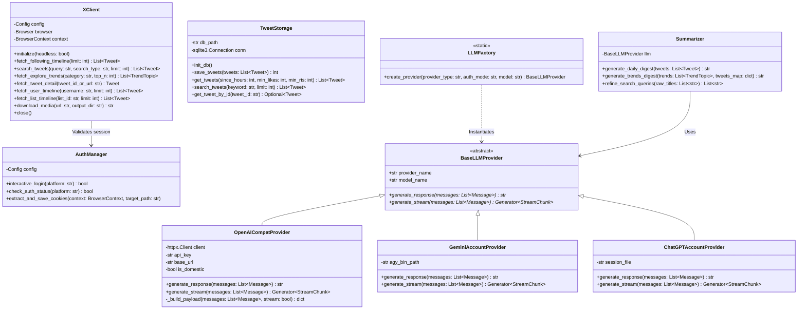
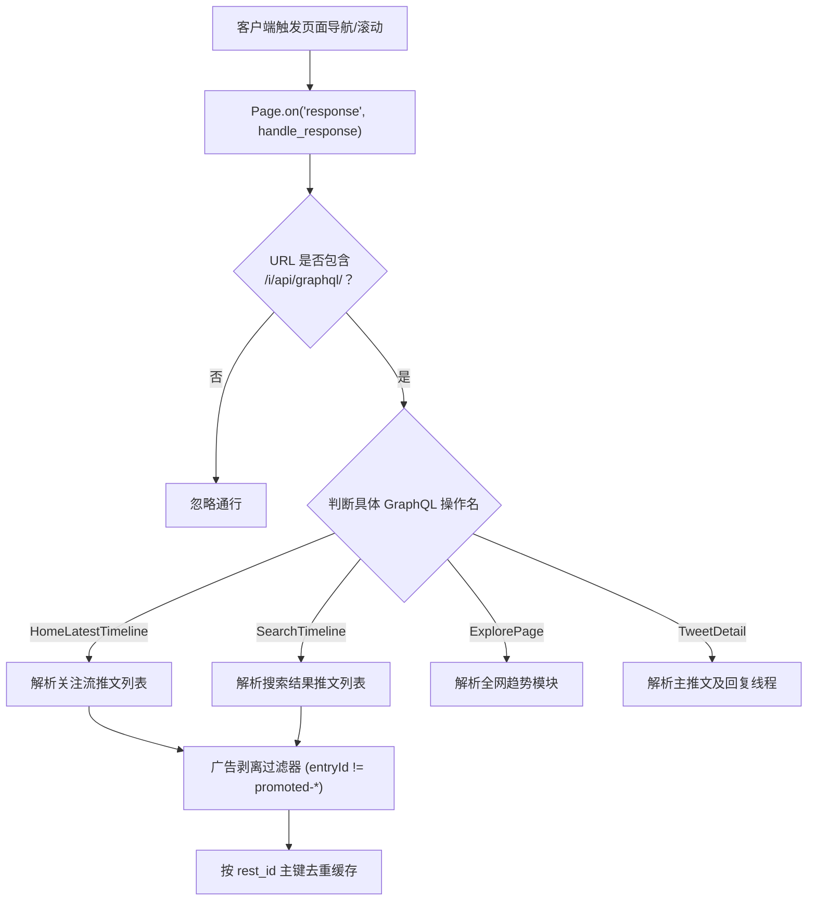
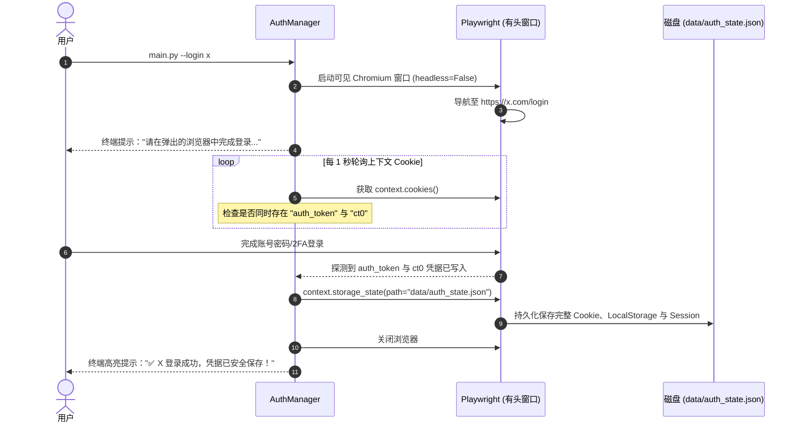
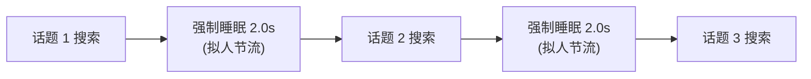

# 系统详细设计与核心机制文档 (Detailed Design Document)

> **文档版本**：v1.0.0  
> **更新时间**：2026-09-22  
> **面向对象**：核心开发人员、系统维护者与扩展接入者。

---

## 1. 核心模块类设计与接口契约

### 1.1 系统类图 (UML Class Diagram)



---

## 2. 关键底层机制与控制流设计

### 2.1 机制 1：Playwright 异步透明网络流拦截与动态防抖

#### 2.1.1 拦截原理与路由分发
推特为单页面 React 应用（SPA），所有数据通过 GraphQL 端点异步拉取。系统启动 Chromium 后，在 `Page.route` 或 `Page.on("response")` 上注册全局监听器：



#### 2.1.2 动态防抖与时机控制 (Timing & Debounce)
- **挑战**：页面发起 GraphQL 请求为异步非阻塞，若页面刚触发导航就立刻断言退出，会捕获到空响应；若等待时间过长则浪费吞吐。
- **解法**：
  1. 页面导航状态采用 `wait_until="domcontentloaded"`，确保推特前端核心渲染引擎就绪；
  2. 采用**累积计数 + 短超时防抖**策略：当捕获到目标首包后，维持 2 秒的防抖窗口（Debounce Window）等待可能的分页包，随后立即恢复执行，兼顾完整性与速度。

---

### 2.2 机制 2：免查 Token 浏览器会话截获

#### 2.2.1 交互式截获时序
为了彻底摆脱让用户打开 F12 手工寻找 `auth_token` 和 `ct0` 的反人类体验，设计了交互式自动化捕获机制：



---

### 2.3 机制 3：时效性双重过滤架构 (Multi-Layer Freshness Guarantee)

#### 2.3.1 为什么需要双重过滤？
- **单靠搜索关键词**：X 平台的 Top 排序由历史累计互动决定，常把数月前的万赞推文排在首位；
- **单靠 X 算子 `since:YYYY-MM-DD`**：推特该算子粒度仅到「天」，且可能存在跨时区边缘漂移；
- **单靠内存硬过滤**：若 X 下发的推文全部被历史推文霸榜，本地硬过滤后会导致有效推文为 0。

#### 2.3.2 双重拦截算法逻辑

```python
# 第一层：精确构造注入 X 搜索算子
now_utc = datetime.now(timezone.utc)
since_date = (now_utc - timedelta(hours=hours)).strftime("%Y-%m-%d")
search_query = f"{refined_keyword} since:{since_date}"

# 第二层：语料进入大模型前的内存 UTC 硬校验
def is_tweet_within_hours(created_at_str: str, hours: int = 48) -> bool:
    if not created_at_str:
        return True
    try:
        # X 官方时间格式: "Fri Sep 21 14:32:00 +0000 2026"
        dt = datetime.strptime(created_at_str, "%a %b %d %H:%M:%S %z %Y")
        return (datetime.now(timezone.utc) - dt).total_seconds() <= hours * 3600
    except Exception:
        return True
```

---

### 2.4 机制 4：AI 搜索词智能提炼与安全串行节流

#### 2.4.1 AI 提炼算法
针对趋势榜单的新闻长标题，直接搜索命中率为 0。系统在下钻前构建专属 Prompt 调用 LLM：
- **输入**：`["DeepSeek Bets Big on Huawei Chips to Train Massive AI Models", "World of Warcraft Classic Fresh 2026 Announced"]`
- **系统约束**：
  > 提取 2~4 个推特用户最常用的核心实体短语/英文原词，禁止使用句式、连词与长定语。
- **输出**：`["DeepSeek Huawei chips", "WoW Classic Fresh"]`

#### 2.4.2 安全串行步长与防风控

- **核心防线**：坚决摒弃 `asyncio.gather` 并发请求。X 风控系统会将同一 Cookie 在 1 秒内的并发 GraphQL 请求标记为自动化脚本并触发 Cloudflare 阻断或封号。单线程串行加 2 秒停顿将风控概率降至零。

---

### 2.5 机制 5：SSE 流式长思维链解析机制

针对主流模型开启 `reasoning_effort: "high"` 后长达 2~3 分钟的深度思考，非流式 HTTP 会直接遭遇 `ReadTimeout`（120 秒断开）。详细数据流如下：


---

## 3. 本地存储模型与数据字典

### 3.1 SQLite 数据库表设计 (`data/tweets.db`)

```sql
CREATE TABLE IF NOT EXISTS tweets (
    tweet_id TEXT PRIMARY KEY,          -- 推文唯一 Snowflake ID
    author_username TEXT NOT NULL,      -- 作者 Handle (如 elonmusk)
    author_name TEXT NOT NULL,          -- 作者昵称展示名
    text TEXT NOT NULL,                 -- 清洗后的完整推文文本
    created_at TEXT NOT NULL,           -- X 原始时间戳 (如 "Fri Sep 21 14:32:00 +0000 2026")
    like_count INTEGER DEFAULT 0,       -- 点赞数
    retweet_count INTEGER DEFAULT 0,    -- 转推/转发数
    reply_count INTEGER DEFAULT 0,      -- 回复数
    quote_count INTEGER DEFAULT 0,      -- 引用数
    view_count INTEGER DEFAULT 0,       -- 浏览曝光量 (Impression)
    media_urls TEXT,                    -- 逗号分隔的原始图片/视频封面 URL
    source_type TEXT DEFAULT 'following',-- 采集来源: following | search | trends | user | list
    fetched_at TIMESTAMP DEFAULT CURRENT_TIMESTAMP -- 本地入库时间戳
);

-- 核心加速索引
CREATE INDEX IF NOT EXISTS idx_tweets_created_at ON tweets(created_at);
CREATE INDEX IF NOT EXISTS idx_tweets_likes ON tweets(like_count);
CREATE INDEX IF NOT EXISTS idx_tweets_source ON tweets(source_type);
```

### 3.2 离线媒体与报告目录规约
- `data/auth_state.json`：仅存储 X 凭证状态（严格 Git 忽略）。
- `data/raw/raw_YYYYMMDD_HHMM.json`：保存近 30 天调试捕获的原始网络快照。
- `output/reports/YYYY-MM-DD.md`：每日关注流智能早报。
- `output/reports/trends_YYYY-MM-DD.md`：全网趋势深度研报。
- `output/tweet_{id}_{author}.md`：离线单篇/长推文无损归档文档。

---

## 4. 多厂商端点路由与特化参数映射

系统自动对 API Key 前缀或配置参数进行智能路由与特化参数装载：

| 厂商 | 标识 | 专属端点 Base URL | 特化思考参数 Payload |
| :--- | :--- | :--- | :--- |
| **阿里千问 (Token Plan)** | `qwen-token-plan` | `https://token-plan.cn-beijing.maas.aliyuncs.com/compatible-mode/v1` | `{"enable_thinking": true, "reasoning_effort": "high"}` |
| **阿里千问 (按量)** | `qwen` | `https://dashscope.aliyuncs.com/compatible-mode/v1` | `{"enable_thinking": true, "reasoning_effort": "high"}` |
| **智谱清言 (Coding Plan)**| `zhipu-code-plan` | `https://open.bigmodel.cn/api/coding/paas/v4` | `{"thinking": {"type": "enabled"}, "reasoning_effort": "high"}` |
| **智谱清言 (普通)** | `zhipu` | `https://open.bigmodel.cn/api/paas/v4` | `{"thinking": {"type": "enabled"}, "reasoning_effort": "high"}` |
| **DeepSeek** | `deepseek` | `https://api.deepseek.com/v1` | `{"thinking": {"type": "enabled"}, "reasoning_effort": "high"}` |
| **MiniMax** | `minimax` | `https://api.minimax.chat/v1` | `{"thinking": {"type": "enabled"}, "reasoning_split": true}` |
| **月之暗面 Kimi** | `kimi` | `https://api.moonshot.cn/v1` | `{"reasoning_effort": "high"}` |
| **OpenAI** | `openai` | `https://api.openai.com/v1` | `{"reasoning_effort": "high"}` |
| **Google Gemini** | `gemini` | 走本地 `agy` 账号免 Key 驱动通道 | `--effort high` / `thinking_level: HIGH` |
