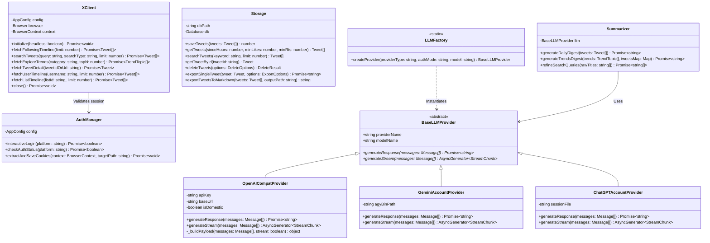
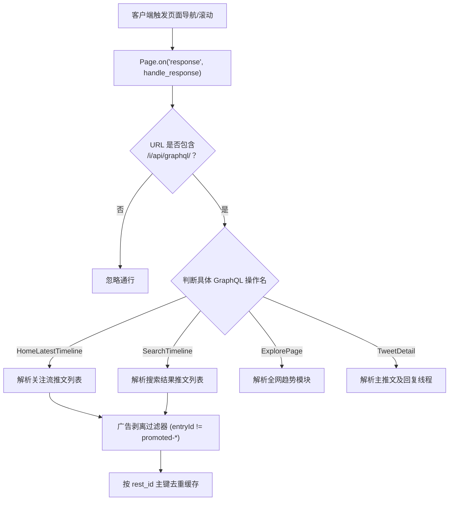
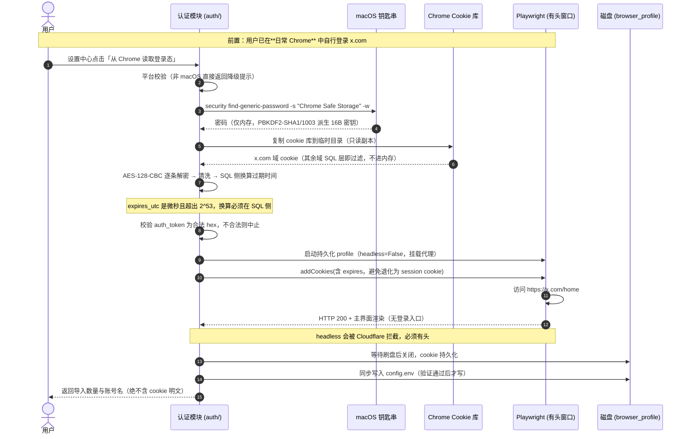
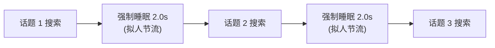
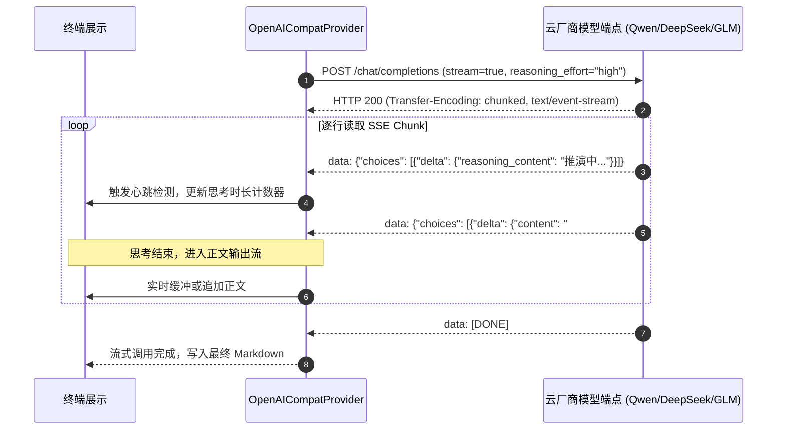

# Xtract 系统详细设计与核心机制文档 (Detailed Design Document)

> **文档修订**：r2（本文档自身修订号，与产品版本相互独立）  
> **对齐产品版本**：v0.1.0  
> **更新时间**：2026-10-01  
> **面向对象**：核心开发人员、系统维护者与扩展接入者。

---

## 1. 核心模块类设计与接口契约

### 1.1 系统类图 (UML Class Diagram)



---

## 2. 关键底层机制与控制流设计

### 2.1 机制 1：Playwright 异步透明网络流拦截与动态防抖

#### 2.1.1 拦截原理与路由分发
推特为单页面 React 应用（SPA），所有数据通过 GraphQL 端点异步拉取。系统启动 Chromium 后，在 `Page.route` 或 `Page.on("response")` 上注册全局监听器：



#### 2.1.2 动态防抖与时机控制 (Timing & Debounce)
- **挑战**：页面发起 GraphQL 请求为异步非阻塞，若页面刚触发导航就立刻断言退出，会捕获到空响应；若等待时间过长则浪费吞吐。
- **解法**：
  1. 页面导航状态采用 `wait_until="domcontentloaded"`，确保推特前端核心渲染引擎就绪；
  2. 采用**累积计数 + 短超时防抖**策略：当捕获到目标首包后，维持 2 秒的防抖窗口（Debounce Window）等待可能的分页包，随后立即恢复执行，兼顾完整性与速度。

---

### 2.2 机制 2：免查 Token 浏览器会话截获

#### 2.2.1 交互式截获时序
为了彻底摆脱让用户打开 F12 手工寻找 `auth_token` 和 `ct0` 的反人类体验，设计了交互式自动化捕获机制：



> **注意**：本流程**不包含任何登录动作**。早期的「自动化登录」机制已下线，
> 原因见 [PRD v0.1.0 §5.6](prd/v0.1.0.md)。严禁重新引入。

---

### 2.3 机制 3
---

### 2.3 机制 3：时效性双重过滤架构 (Multi-Layer Freshness Guarantee)

#### 2.3.1 为什么需要双重过滤？
- **单靠搜索关键词**：X 平台的 Top 排序由历史累计互动决定，常把数月前的万赞推文排在首位；
- **单靠 X 算子 `since:YYYY-MM-DD`**：推特该算子粒度仅到「天」，且可能存在跨时区边缘漂移；
- **单靠内存硬过滤**：若 X 下发的推文全部被历史推文霸榜，本地硬过滤后会导致有效推文为 0。

#### 2.3.2 双重拦截算法逻辑

```typescript
// 第一层：精确构造注入 X 搜索算子
const nowUtc = new Date();
const sinceDate = new Date(nowUtc.getTime() - hours * 3600 * 1000).toISOString().slice(0, 10);
const searchQuery = `${refinedKeyword} since:${sinceDate}`;

// 第二层：语料进入大模型前的内存 UTC 硬校验
export function isTweetWithinHours(createdAtStr: string, hours: number = 48): boolean {
  if (!createdAtStr) return true;
  try {
    const dt = new Date(createdAtStr);
    return (Date.now() - dt.getTime()) <= hours * 3600 * 1000;
  } catch {
    return true;
  }
}
```

---

### 2.4 机制 4：AI 搜索词智能提炼与安全串行节流

#### 2.4.1 AI 提炼算法
针对趋势榜单的新闻长标题，直接搜索命中率为 0。系统在下钻前构建专属 Prompt 调用 LLM：
- **输入**：`["DeepSeek Bets Big on Huawei Chips to Train Massive AI Models", "World of Warcraft Classic Fresh 2026 Announced"]`
- **系统约束**：
  > 提取 2~4 个推特用户最常用的核心实体短语/英文原词，禁止使用句式、连词与长定语。
- **输出**：`["DeepSeek Huawei chips", "WoW Classic Fresh"]`

#### 2.4.2 安全串行步长与防风控

- **核心防线**：坚决摒弃 `Promise.all` 等无节制并发请求。X 风控系统会将同一 Cookie 在 1 秒内的并发 GraphQL 请求标记为自动化脚本并触发 Cloudflare 阻断或封号。单线程串行加 2 秒停顿将风控概率降至零。

---

### 2.5 机制 5：SSE 流式长思维链解析机制

针对主流模型开启 `reasoning_effort: "high"` 后长达 2~3 分钟的深度思考，非流式 HTTP 会直接遭遇网络连接超时（如 60s/120s 空闲挂起）。详细数据流如下：



---

### 2.6 机制 6：关注流与多源采集数量精准控制机制 (Limit Contract & Early Stop)

传统爬虫因推特官方 GraphQL 单个响应包下发量大（如关注流 HomeTimeline 单包常达 100+ 条推文），容易导致前端要求抓取 20 条却被灌入 121 条。系统建立了全链路数量约束契约：
1. **统一契约参数透传**：`StudioView` (UI) -> `IPC` -> `Pipeline.fetchAndStore` -> `XClient.fetchFollowingTimeline` 全链路传递明确的 `limit` 参数；
2. **提前终止滚动 (Early Termination)**：在向下滚动加载循环中，动态统计已解析推文数量。一旦 `countSoFar >= limit`，**立即中断 `for` 循环提前退出**，杜绝无意义的滚动与网络等待，将抓取时间缩短 60% 以上；
3. **精准切片落库**：最终返回前严格执行 `allTweets.slice(0, limit)`，确保入库条数与前端展示 100% 符合用户选择。

**抓取入库类 IPC 的统一返回契约**（`FetchAndStoreResult`，v0.1.0 起）：
`fetchUserAndStore` / `fetchListAndStore` / `fetchSearchAndStore` 统一返回 `{ tweets, fetched, inserted, skipped }`——`fetched` 为从 X 拉取的条数，`inserted` / `skipped` 为 `saveTweets` 的真实落库统计（新增 / 主键去重跳过）。IPC 层原样透传给渲染层，完成提示（toast 与进度卡片）必须使用这些真实数字，**严禁用 `fetched` 冒充 `inserted` 或把 `skipped` 写死为 0**。历史上列表源曾因 handler 返回裸数组、前端拿到 `undefined` 统计而提示"入库 13 条"（实为 13 条全部重复），引发用户对数据丢失的误判。

**X 列表滚动加载的停止判据**（`shouldScrollListTimeline` 纯函数）：按「实际捕获的 GraphQL 响应批次数」驱动滚动——批次达到 `ceil(limit/20)` 停；连续 3 屏无新增批次（列表内容到底）提前停；轮数硬上限（目标页数 + 4）兜底。禁止退回固定轮数滚动（慢加载列表会少抓一半以上，真机实测 limit=50 实得 15 条）。

---

### 2.7 机制 7：推特视频免落盘流式播放与防盗链穿透架构

为了彻底解决「视频下载落盘吞噬本地磁盘」以及「Chromium 原生 `<video controls>` 因网络直连被墙导致播放按钮禁用」的痛点，系统设计了双层保障方案：
1. **主进程网络穿透层**：
   - 自动探活本地科学上网端口，调用 `session.defaultSession.setProxy({ proxyRules })` 将代理注入 Electron 渲染进程网络栈；
   - 拦截 `*://*.twimg.com/*` 请求，在 `webRequest.onBeforeSendHeaders` 中伪装注入 `Referer: https://x.com/` 与 `Origin: https://x.com`，攻克 CDN 防盗链；
2. **渲染进程 `TweetVideoPlayer` 组件层**：
   - **零静默流量与杜绝未播转圈（`preload="none"`）**：避免 Chromium 在挂载 DOM 时自动向推特视频 CDN 发起探测请求并因代理握手引发过早缓冲转圈；增加播放状态安全护栏，未播放时绝不消耗任何网络流量；
   - **大号居中播放按钮 Overlay**：未播放前仅安静展示高清视频封面（Poster）与居中毛玻璃质感播放按钮（▶），点击画面任意位置或按钮即刻触发 `videoRef.current.play()`；
   - **缓冲与状态机**：仅在用户已触发播放（`isPlaying=true`）后监听 `onWaiting`、`onCanPlay`、`onError`，在首帧缓冲或网络波动时展示 Loading 旋转动画，避免用户误以为无响应；
   - **双轨容灾直达**：遇到解码受阻时自动弹出错误自愈卡片，并提供常驻的【📋 复制直链】与【🌐 在系统浏览器播放 ↗】快捷按钮，一键调起 Safari / Chrome 高速播放。

---

### 2.8 机制 8：macOS 原生桌面窗口生命周期管理

针对桌面端用户习惯设计无感响应生命周期：
- 拦截主窗口的 `close` 事件：`if (process.platform === 'darwin' && !isQuitting) { e.preventDefault(); win.hide(); }`，保持后台常驻，不销毁 Chromium 实例与 IPC 状态；
- 监听 `app.on('activate')`：当用户点击 Dock 图标时，若窗口已隐藏则执行 `win.show(); win.focus();`，毫秒级无感知唤起；
- 监听 `app.on('before-quit')`：置位 `isQuitting = true`，确保用户通过快捷键（Cmd+Q）或托盘退出时能正常释放资源并退出进程。

---

### 2.9 机制 9：图文推文全媒体呈现、全屏灯箱与截断判定

针对图文类推文详情展示与多媒体落盘的一体化交互优化：
1. **多媒体类型解耦与排他过滤修复**：
   - 严格区分视频推文（`isVideo`）与图文推文。仅在视频推文时提取 `video_poster` 并用于播放器封面；图文推文的 `posterUrl` 恒为 `undefined`，杜绝把首张配图当成封面过滤的 Bug；
   - 所有非视频格式的媒体链接全量纳入 `displayImages`，确保单图、双图或四宫格推文全部完整呈现。
2. **现代网格排版与全屏灯箱 (Lightbox Modal)**：
   - **单图**：自适应居中大图，最大高度限制 520px，`objectFit: contain`；
   - **多图**：双列网格（`1fr 1fr`），统一度量；
   - **全屏灯箱**：点击推文配图瞬间呼出全屏高斯模糊遮罩的大图灯箱，支持 ESC 键或点击遮罩关闭，配备【📋 复制直链】与【🌐 系统浏览器打开 ↗】；
   - **错误自愈**：图片因网络波动或防盗链加载失败时自动展示友好占位卡片与浏览器直链按钮，绝无裂图死等。
3. **截断 Note Tweet 与短图文精准识别规约 (`isTweetContentIncomplete`)**：
   - 推特官方在下发带图短推文时正文末尾会自然携带附件短链（`https://t.co/...`）。系统废除粗暴的 `< 120` 字符误判规则，仅在正文末尾命中省略号（`…` 或 `...`）接 `t.co`、末尾直接为省略号、或 X Article 缺少长文正文时才判定为不完整长文，避免普通图文推文在点击时反复陷入无谓的网络全量拉取。

---

### 2.10 机制 10：推文详情原生 Markdown 渲染与 Executive Summary 专属卡片机制

为彻底杜绝 X Article 专栏抓取入库后在详情面板直接暴露裸露 Markdown 标记（`# 标题`、`> **核心摘要 / 提要**:`、`- 列表`）的粗糙体验，系统开发了原生 `TweetMarkdown` 引擎：
1. **轻量 AST 块级扫描分词器 (`TweetMarkdown.tsx`)**：
   - **标题层级 (H1~H4)**：精准识别 `# ` 专栏大标题、`## ` 章节小标题，并自动增强「一、趋势低吸」这类中文段落章节标题；
   - **列表与段落排版**：智能归并连续的 `- ` / `* ` 无序列表与数字有序列表，段落行高统一为 `1.8` 并去除粗暴的 `whiteSpace: 'pre-wrap'`，根治重复双换行；
   - **内联富文本分词器**：单次正则扫描精准解析 `**粗体**`、`*斜体*`、`` `行内代码` ``、`~~删除线~~` 以及 `[label](url)` 超链接与图片；
2. **X Article 专栏专属「⚡ 核心摘要 / 提要」速览卡片**：
   - 智能识别以 `> **核心摘要 / 提要**:` 开头的引用块，将其自动提升为报刊杂志风格的高光速览卡片（Executive Summary Card）；
   - 卡片采用浅色暖底沉降背景、天蓝色左强调边框（`4px solid var(--accent)`）、专属闪电徽标（⚡）与紧凑优雅的列表项，使用户一眼获取专栏核心价值；
3. **全媒体内联交互闭环**：
   - 正文内联图片居中呈现，点击直接无缝呼出全屏高斯模糊灯箱（支持 ESC 退出与外链打开）；
   - 正文外链与推特短链（`t.co`）自动还原为带有 `↗` 标识的可点击超链接，点击直接调起系统默认浏览器。

---

## 3. 本地存储模型与数据字典

### 3.1 SQLite 数据库表设计 (`data/tweets.db`)

```sql
CREATE TABLE IF NOT EXISTS tweets (
    tweet_id TEXT PRIMARY KEY,          -- 推文唯一 Snowflake ID
    author_id TEXT,                     -- 作者数字 ID
    author_name TEXT NOT NULL,          -- 作者昵称展示名
    author_username TEXT NOT NULL,      -- 作者 Handle (如 elonmusk)
    text TEXT NOT NULL,                 -- 清洗后的完整推文文本
    created_at TEXT NOT NULL,           -- ISO-8601 标准化时间戳
    is_retweet INTEGER DEFAULT 0,       -- 是否为转推
    retweeted_author TEXT,              -- 原作者 handle
    retweeted_text TEXT,                -- 原推文内容
    is_quote INTEGER DEFAULT 0,         -- 是否为引用推文
    quoted_author TEXT,                 -- 引用原作者
    quoted_text TEXT,                   -- 引用原内容
    like_count INTEGER DEFAULT 0,       -- 点赞数
    retweet_count INTEGER DEFAULT 0,    -- 转推/转发数
    reply_count INTEGER DEFAULT 0,      -- 回复数
    view_count INTEGER DEFAULT 0,       -- 浏览曝光量 (Impression)
    urls TEXT,                          -- 包含的外链 JSON 字符串
    media_urls TEXT,                    -- 配图/封面图 URL 列表 JSON 数组
    video_url TEXT,                     -- 推特最高清 MP4 在线流媒体直链
    video_poster TEXT,                  -- 视频首帧封面缩略图 URL
    source_type TEXT DEFAULT 'following',-- 采集来源: following | search | trends | user | list
    list_id TEXT,                       -- 所属 X 列表 ID
    fetched_at TIMESTAMP DEFAULT CURRENT_TIMESTAMP -- 本地入库时间戳
);

-- 核心加速索引
CREATE INDEX IF NOT EXISTS idx_tweets_created_at ON tweets(created_at);
CREATE INDEX IF NOT EXISTS idx_tweets_likes ON tweets(like_count);
CREATE INDEX IF NOT EXISTS idx_tweets_source ON tweets(source_type);
CREATE INDEX IF NOT EXISTS idx_tweets_list_id ON tweets(list_id);
```

#### 数据库平滑演进与历史数据自动回填 (Auto-Migration & Backfill)
- **字段动态补齐**：系统启动初始化 `Storage.initDb()` 时，通过 `PRAGMA table_info` 探测已有库结构，自动增量执行 `ALTER TABLE tweets ADD COLUMN video_url TEXT` 等语句；
- **存量推文视频信息自愈**：自动扫描 `video_url IS NULL` 但 `media_urls` 包含视频链接的历史存量记录，提取最高码率 MP4 与封面图并事务回填，确保新老推文均可享受原生免落盘在线播放。

### 3.2 离线媒体与报告目录规约
- `data/auth_state.json`：仅存储 X 凭证状态（严格 Git 忽略）。
- `data/raw/raw_YYYYMMDD_HHMM.json`：保存近 30 天调试捕获的原始网络快照。
- `output/reports/YYYY-MM-DD.md`：每日关注流智能早报。
- `output/reports/trends_YYYY-MM-DD.md`：全网趋势深度研报。
- `output/{author}/{tweet_id}/index.md`：自包含单篇推文/长文 Page Bundle，专属配图保存在 `images/`。

### 3.3 数据清理与级联删除机制 (Cascade Purge Guarantee)
为防止本地推文库无序膨胀并保证数据库与文件系统强一致，系统提供统一的级联删除核心能力：
1. **多维条件过滤**：支持按推文 ID/URL、博主用户名（忽略大小写与 `@` 符号）、发布或入库时间范围（`--since`、`--until`）、过期存留周期（`--older-than 30d/48h`）或内容类别（`--only-short` 仅删除非长推文、非专栏的普通推文）精确定位待删除推文集合。
2. **两阶段原子操作**：
   - 先查询定位所有命中的推文列表；
   - 物理清理文件：遍历命中推文，彻底删除 `output/{author}/{tweet_id}/` 目录（及其下 `index.md` 与配图）；兼容清理可能遗留的旧版文件；若清理后 `{author}` 目录为空，自动修剪清理空目录；
   - SQLite 事务删除：开启事务执行 `DELETE FROM tweets WHERE tweet_id IN (...)`，确保元数据与磁盘文件同步销毁。
3. **安全交互防护 (Defensive Safety)**：
   - 严禁空条件盲删：必须提供推文 ID、`--user`、`--since`、`--until`、`--older-than` 或 `--only-short` 中至少一项；
   - 预演支持：提供 `--dry-run` 标志，只返回命中行数及拟删除目录树，不触发任何真实写操作；
   - 人机交互确认：终端非 `--json` 且未携带 `-y/--yes` 时，强制提示输入 `y/N` 确认，防止自动化失控或手滑误删。

### 3.4 推文正文超链接富文本化与媒体短链清洗机制
为解决 X 原生 `t.co` 短链混排导致的语义丢失、无法点击以及图片附件短链尾缀冗余问题，系统在网络抓取、数据持久化与视图渲染各层实施闭环：
1. **网络抓取与解析层 (`parser.ts`)**：
   - 提取推文 payload 中的 `entities.urls`（包含 `url`、`expanded_url`、`display_url`）与 `entities.media`（包含附件媒体短链）；
   - 正文尾缀媒体短链剔除：使用严格正则 `/\s*https:\/\/t\.co\/[a-zA-Z0-9]+$/g` 自动修剪仅作为媒体展示的末尾无意义链接；
   - 严格边界外链替换：针对正文中夹杂在汉字、英文之间的外部短链，使用无侵蚀正则将 `https://t.co/xxx` 转换为 `[display_url](expanded_url)` Markdown 标准格式，杜绝 `\S+` 贪婪匹配误吞中文后续文字；
2. **渲染与交互层 (`views/studio/formatters.tsx` + `TweetDetailPane.tsx`)**：
   - 实现 `renderFormattedTweetText` 富文本分词器，优先捕获 Markdown 链接 `[label](url)`，其次捕获标准 HTTP/HTTPS 裸 URL；
   - 渲染为具有现代毛玻璃对比度的超链接胶囊/文字，支持鼠标 hover 悬停下划线与 `↗` 标识，点击无缝调用 `api.openExternal(url)` 唤起系统浏览器；
3. **数据库存储与导出层 (`storage/index.ts`)**：
   - `initDb` 自动执行增量事务迁移，扫描库内存量推文，利用推文持久化的 `urls` 元数据将历史残留的 `t.co` 平滑自愈为 Markdown 链接；
   - Markdown 归档导出 (`index.md`) 同步清洗尾部媒体短链并对齐 Markdown 链接，确保本地知识库可读性与自包含性。

### 3.5 长推文/专栏文章默认抓取过滤与物理换行规整机制
针对 X 关注流、列表与搜索中大量单句闲聊、碎片碎碎念以及字面量换行符暴露问题，系统构建了长文深度过滤与排版自愈闭环：
1. **长文与专栏识别判定维度**：
   - **专栏文章 (X Article)**：命中 `tweet.article?.article_results`、推文外链包含 `x.com/i/article/\d+` 或正文以 `# ` Markdown 大标题开头；
   - **长推文 (Note Tweet)**：命中推特官方 `note_tweet` 字段、正文字符数 > 280、或正文末尾被推特按省略号截断（`… https://t.co/...`）；
   - **普通短推文**：不满足上述条件的单条短推文。
2. **抓取链路双重约束与早停**：
   - `FETCH_ONLY_LONG_TWEETS` 默认开启（为 `true`）。客户端（`XClient`）在执行向下滚动与网络流嗅探时，分页累加仅统计符合条件的长内容推文，一旦达到用户所选配额（如 20 篇）立即提前终止滚动，避免拉取海量无效短推文；
   - 流水线入库（`Pipeline`）前执行二次校验拦截，确保落库推文 100% 具备深度阅读价值；
   - 桌面设置中心（`SettingsDrawer`）提供即时可视化的【抓取过滤规则】开关；终端 CLI 提供 `--all-tweets` 选项支持按需放开。
3. **换行符字面量 `\n\n` 平滑自愈**：
   - 在 `parser` 格式化、`storage` 入库映射、`initDb` 存量迁移及前端视图分词渲染各层建立统一反转义流水线：`.replace(/\\r\\n/g, '\n').replace(/\\n/g, '\n').replace(/\r\n/g, '\n')`；
   - 彻底消除存量推文与新推文中未经反转义的 `\n\n` 字面量字符，还原推特原汁原味的段落排版。

### 3.6 推文详情原生 Markdown 渲染与 X Article 专栏专属排版机制
X Article 专栏文章通常为数千至上万字的高价值研报，正文按 Markdown 规范存储大标题（`#`）、核心摘要引用块（`> **核心摘要 / 提要**:`）、中文章节与列表。
1. **轻量级原生 TweetMarkdown 渲染引擎**：
   - 彻底避免厚重的三方富文本依赖，在渲染进程定制轻量级分词解析器；
   - 智能识别 H1-H4 大小标题、代码块、列表项、中文段落节次；
   - 核心速览卡片（⚡）：对包含 `**核心摘要 / 提要**` 的引用块渲染为极具杂志质感的高光速览卡片，配备专属羽毛笔/闪电高亮图标；
2. **段落行距与排版质感**：
   - 段落间距自适应，消除字面量换行符造成的贴合挤压；
   - 支持正文中的超链接识别并一键调起系统默认浏览器。

### 3.7 推特视频按需流式加载与零静默流量策略机制 (Demand-Driven Video Streaming)
1. **静默流量阻断**：
   - 内置播放器（`TweetVideoPlayer`）严格配置 `preload="none"`，未播放时仅展示高清封面图（Poster）与居中大播放按钮【▶】；
   - 杜绝旧实现 `preload="metadata"` 在推文切换时静默向推特视频 CDN（`video.twimg.com`）发起探测请求而消耗用户代理节点流量，彻底消除未播放前的缓冲转圈等待焦虑。
2. **会话级代理穿透与防盗链注入**：
   - 主进程自动挂载会话代理 `session.defaultSession.setProxy`；
   - 动态注入官方 `Referer: https://x.com/`，规避推特视频 CDN 的跨域防盗链拦截；
3. **播放容灾与双轨通道**：
   - 提供缓冲状态提示与错误自愈；
   - 界面常驻提供【📋 复制直链】与【🌐 在系统浏览器播放 ↗】双轨高速通道，保证任意复杂网络环境下的播放可用性。

### 3.8 单推作者追评抓取受控与默认零碎贴机制 (Author Replies On-Demand)
1. **默认零碎贴策略**：
   - 单篇推文抓取时，默认 `fetchAuthorReplies = false`，仅抓取目标推文本体，自动过滤掉该推文下方作者的所有追加评论；
   - 避免抓取耗时拉长、推文列表被同作者多条碎推文冲刷、以及本地 Markdown 导出产生多余篇章拼接。
2. **按需抓取与早期过滤**：
   - `fetchTweetThread` 在嗅探到响应后立即执行早期过滤：若未开启追评抓取，仅返回主推文；若开启，则仅保留原作者发表的连续回复（Thread），同时清洗掉非原作者的路人灌水评论；
   - `pipeline.fetchTweetAndStore` 联动受控落库，确保无用推文不写入本地 SQLite；
3. **双模受控与缓存自愈**：
   - GUI 设置中心（`SettingsDrawer`）提供【抓取作者追评与追加回复】可视化开关；
   - CLI 命令行提供 `--author-replies` 与 `--no-author-replies` 选项，且具备缓存自愈能力（若本地仅存单推而命令显式带 `--author-replies`，自动重新发起网络拉取补全）。

### 3.9 图文推文全媒体呈现与高斯模糊灯箱预览机制
1. **解耦视频与配图过滤通道**：
   - 旧逻辑将视频封面错误应用至普通图文推文导致单图推文不显示；重构后彻底解耦视频与普通配图通道，100% 完整呈现单图与多图。
2. **推特现代网格布局**：
   - 单图高清展示，双图并列，三图/四图自适应推特官方经典网格布局；
3. **沉浸式灯箱预览 (Lightbox)**：
   - 点击推文配图瞬间呼出全屏高斯模糊灯箱；
   - 支持键盘 `ESC` 键快捷退出、点击外部蒙层关闭、以及右上方【在浏览器打开原图 ↗】直达高清原图。

---

## 4. 多厂商大模型驱动、端点路由与特化参数映射

### 4.1 7 大主流模型 2026 最新版本与文档约定（全量默认开启 high 级长推理）
- **Google Gemini**：默认主力 `gemini-3.8-flash`（高智商超高速，全模态，`--effort high` / `thinking_level: HIGH`），长推理 `gemini-3.1-pro`，轻量 `gemini-2.5-flash`。
- **OpenAI GPT**：默认主力 `gpt-5.6-sol`（GPT-5.6 Sol 旗舰全模态推理，默认 `reasoning_effort: "high"`，兼容 `gpt-5.6` 别名）。
- **DeepSeek**：默认主力 `deepseek-flash`（DeepSeek-V4.1-Flash，1M上下文多模态，默认 `thinking: {"type": "enabled"}` 与 `reasoning_effort: "high"`），高阶 `deepseek-v4-pro`。
- **阿里通义千问 Qwen**：默认主力 `qwen3.8-flash`（原生全模态推理，默认携带 `enable_thinking: true` 与 `reasoning_effort: "high"`），旗舰 `qwen3.8-max`，平衡版 `qwen3.7-plus`。
  - 普通按量端点：`https://dashscope.aliyuncs.com/compatible-mode/v1`（Key 为 `sk-` 开头）
  - **Token Plan 专属端点**：`https://token-plan.cn-beijing.maas.aliyuncs.com/compatible-mode/v1`（Key 为 `sk-sp-` 开头，系统自动识别）
- **智谱清言 Zhipu**：默认主力 `glm-5.3-flash`（原生多模态高吞吐，默认携带 `thinking: {"type": "enabled"}` 与 `reasoning_effort: "high"`），旗舰复杂工程 `glm-5.3`，极速 `glm-5.3-flashx`。
  - 普通开放平台端点：`https://open.bigmodel.cn/api/paas/v4`
  - **Coding Plan 专属端点**：`https://open.bigmodel.cn/api/coding/paas/v4`
- **MiniMax**：默认主力 `MiniMax-M3`（1M多模态旗舰，默认启用 `thinking: {"type": "enabled"}` 与 `reasoning_split: true`），极速 `MiniMax-M2.7-highspeed`。
- **月之暗面 Kimi**：默认主力 `kimi-k3`（2.8T参数1M上下文旗舰，原生全模态推理，默认携带 `reasoning_effort: "high"`），代码 `kimi-k2.7-code`。

### 4.2 厂商端点路由与特化参数装载矩阵

| 厂商 | 标识 | 专属端点 Base URL | 特化思考参数 Payload |
| :--- | :--- | :--- | :--- |
| **阿里千问 (Token Plan)** | `qwen-token-plan` | `https://token-plan.cn-beijing.maas.aliyuncs.com/compatible-mode/v1` | `{"enable_thinking": true, "reasoning_effort": "high"}` |
| **阿里千问 (按量)** | `qwen` | `https://dashscope.aliyuncs.com/compatible-mode/v1` | `{"enable_thinking": true, "reasoning_effort": "high"}` |
| **智谱清言 (Coding Plan)**| `zhipu-code-plan` | `https://open.bigmodel.cn/api/coding/paas/v4` | `{"thinking": {"type": "enabled"}, "reasoning_effort": "high"}` |
| **智谱清言 (普通)** | `zhipu` | `https://open.bigmodel.cn/api/paas/v4` | `{"thinking": {"type": "enabled"}, "reasoning_effort": "high"}` |
| **DeepSeek** | `deepseek` | `https://api.deepseek.com/v1` | `{"thinking": {"type": "enabled"}, "reasoning_effort": "high"}` |
| **MiniMax** | `minimax` | `https://api.minimax.chat/v1` | `{"thinking": {"type": "enabled"}, "reasoning_split": true}` |
| **月之暗面 Kimi** | `kimi` | `https://api.moonshot.cn/v1` | `{"reasoning_effort": "high"}` |
| **OpenAI** | `openai` | `https://api.openai.com/v1` | `{"reasoning_effort": "high"}` |
| **Google Gemini** | `gemini` | 走本地 `agy` 账号免 Key 驱动通道 | `--effort high` / `thinking_level: HIGH` |

