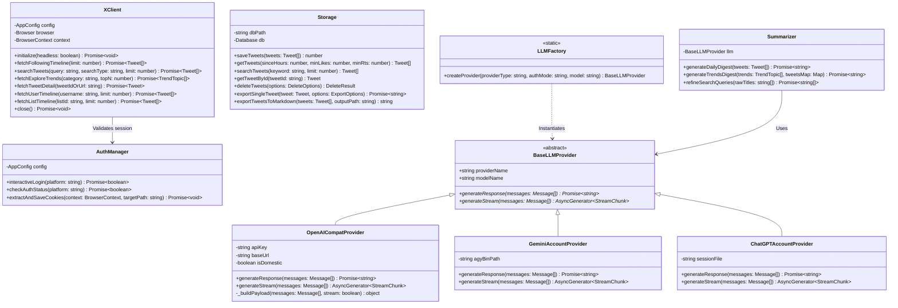
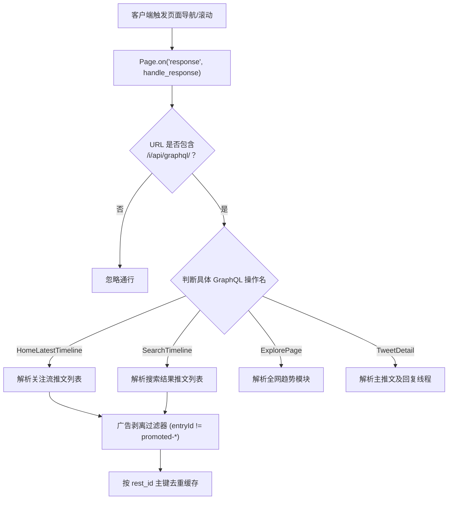
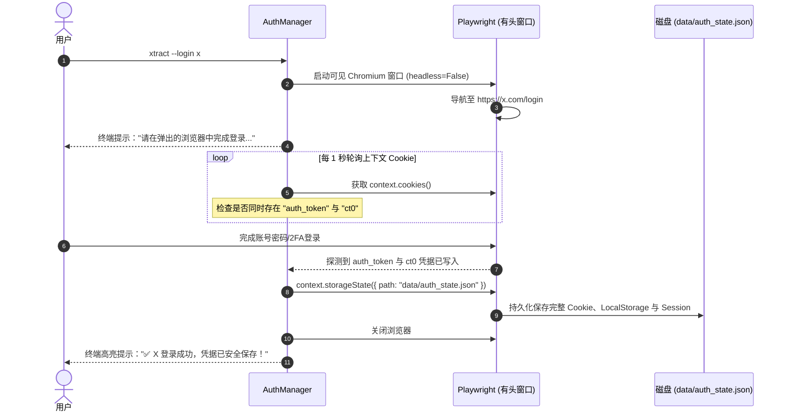
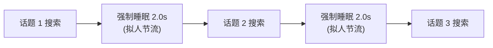
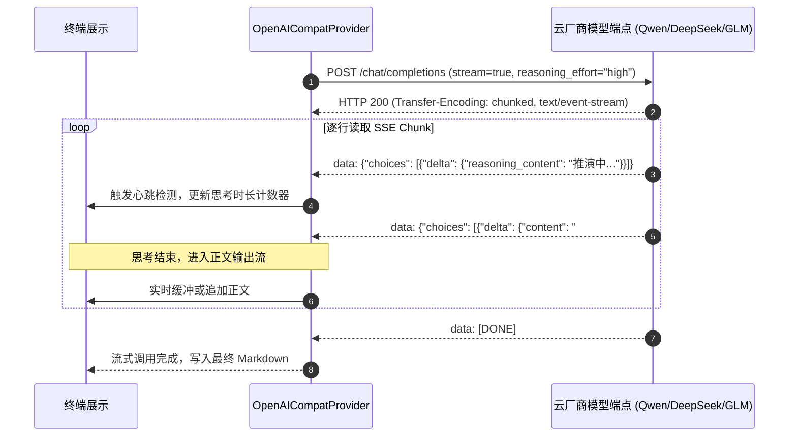

# Xtract 系统详细设计与核心机制文档 (Detailed Design Document)

> **文档版本**：v1.0.0  
> **更新时间**：2026-09-27  
> **面向对象**：核心开发人员、系统维护者与扩展接入者。

---

## 1. 核心模块类设计与接口契约

### 1.1 系统类图 (UML Class Diagram)



---

## 2. 关键底层机制与控制流设计

### 2.1 机制 1：Playwright 异步透明网络流拦截与动态防抖

#### 2.1.1 拦截原理与路由分发
推特为单页面 React 应用（SPA），所有数据通过 GraphQL 端点异步拉取。系统启动 Chromium 后，在 `Page.route` 或 `Page.on("response")` 上注册全局监听器：



#### 2.1.2 动态防抖与时机控制 (Timing & Debounce)
- **挑战**：页面发起 GraphQL 请求为异步非阻塞，若页面刚触发导航就立刻断言退出，会捕获到空响应；若等待时间过长则浪费吞吐。
- **解法**：
  1. 页面导航状态采用 `wait_until="domcontentloaded"`，确保推特前端核心渲染引擎就绪；
  2. 采用**累积计数 + 短超时防抖**策略：当捕获到目标首包后，维持 2 秒的防抖窗口（Debounce Window）等待可能的分页包，随后立即恢复执行，兼顾完整性与速度。

---

### 2.2 机制 2：免查 Token 浏览器会话截获

#### 2.2.1 交互式截获时序
为了彻底摆脱让用户打开 F12 手工寻找 `auth_token` 和 `ct0` 的反人类体验，设计了交互式自动化捕获机制：



---

### 2.3 机制 3：时效性双重过滤架构 (Multi-Layer Freshness Guarantee)

#### 2.3.1 为什么需要双重过滤？
- **单靠搜索关键词**：X 平台的 Top 排序由历史累计互动决定，常把数月前的万赞推文排在首位；
- **单靠 X 算子 `since:YYYY-MM-DD`**：推特该算子粒度仅到「天」，且可能存在跨时区边缘漂移；
- **单靠内存硬过滤**：若 X 下发的推文全部被历史推文霸榜，本地硬过滤后会导致有效推文为 0。

#### 2.3.2 双重拦截算法逻辑

```typescript
// 第一层：精确构造注入 X 搜索算子
const nowUtc = new Date();
const sinceDate = new Date(nowUtc.getTime() - hours * 3600 * 1000).toISOString().slice(0, 10);
const searchQuery = `${refinedKeyword} since:${sinceDate}`;

// 第二层：语料进入大模型前的内存 UTC 硬校验
export function isTweetWithinHours(createdAtStr: string, hours: number = 48): boolean {
  if (!createdAtStr) return true;
  try {
    const dt = new Date(createdAtStr);
    return (Date.now() - dt.getTime()) <= hours * 3600 * 1000;
  } catch {
    return true;
  }
}
```

---

### 2.4 机制 4：AI 搜索词智能提炼与安全串行节流

#### 2.4.1 AI 提炼算法
针对趋势榜单的新闻长标题，直接搜索命中率为 0。系统在下钻前构建专属 Prompt 调用 LLM：
- **输入**：`["DeepSeek Bets Big on Huawei Chips to Train Massive AI Models", "World of Warcraft Classic Fresh 2026 Announced"]`
- **系统约束**：
  > 提取 2~4 个推特用户最常用的核心实体短语/英文原词，禁止使用句式、连词与长定语。
- **输出**：`["DeepSeek Huawei chips", "WoW Classic Fresh"]`

#### 2.4.2 安全串行步长与防风控

- **核心防线**：坚决摒弃 `Promise.all` 等无节制并发请求。X 风控系统会将同一 Cookie 在 1 秒内的并发 GraphQL 请求标记为自动化脚本并触发 Cloudflare 阻断或封号。单线程串行加 2 秒停顿将风控概率降至零。

---

### 2.5 机制 5：SSE 流式长思维链解析机制

针对主流模型开启 `reasoning_effort: "high"` 后长达 2~3 分钟的深度思考，非流式 HTTP 会直接遭遇网络连接超时（如 60s/120s 空闲挂起）。详细数据流如下：



---

### 2.6 机制 6：关注流与多源采集数量精准控制机制 (Limit Contract & Early Stop)

传统爬虫因推特官方 GraphQL 单个响应包下发量大（如关注流 HomeTimeline 单包常达 100+ 条推文），容易导致前端要求抓取 20 条却被灌入 121 条。系统建立了全链路数量约束契约：
1. **统一契约参数透传**：`StudioView` (UI) -> `IPC` -> `Pipeline.fetchAndStore` -> `XClient.fetchFollowingTimeline` 全链路传递明确的 `limit` 参数；
2. **提前终止滚动 (Early Termination)**：在向下滚动加载循环中，动态统计已解析推文数量。一旦 `countSoFar >= limit`，**立即中断 `for` 循环提前退出**，杜绝无意义的滚动与网络等待，将抓取时间缩短 60% 以上；
3. **精准切片落库**：最终返回前严格执行 `allTweets.slice(0, limit)`，确保入库条数与前端展示 100% 符合用户选择。

---

### 2.7 机制 7：推特视频免落盘流式播放与防盗链穿透架构

为了彻底解决「视频下载落盘吞噬本地磁盘」以及「Chromium 原生 `<video controls>` 因网络直连被墙导致播放按钮禁用」的痛点，系统设计了双层保障方案：
1. **主进程网络穿透层**：
   - 自动探活本地科学上网端口，调用 `session.defaultSession.setProxy({ proxyRules })` 将代理注入 Electron 渲染进程网络栈；
   - 拦截 `*://*.twimg.com/*` 请求，在 `webRequest.onBeforeSendHeaders` 中伪装注入 `Referer: https://x.com/` 与 `Origin: https://x.com`，攻克 CDN 防盗链；
2. **渲染进程 `TweetVideoPlayer` 组件层**：
   - **大号居中播放按钮 Overlay**：居中叠加毛玻璃质感播放按钮（▶），点击画面任意位置或按钮即刻触发 `videoRef.current.play()`；
   - **缓冲与状态机**：监听 `onWaiting`、`onCanPlay`、`onError`，在首帧缓冲时展示 Loading 旋转动画，避免用户误以为无响应；
   - **双轨容灾直达**：遇到解码受阻时自动弹出错误自愈卡片，并提供常驻的【📋 复制直链】与【🌐 在系统浏览器播放 ↗】快捷按钮，一键调起 Safari / Chrome 高速播放。

---

### 2.8 机制 8：macOS 原生桌面窗口生命周期管理

针对桌面端用户习惯设计无感响应生命周期：
- 拦截主窗口的 `close` 事件：`if (process.platform === 'darwin' && !isQuitting) { e.preventDefault(); win.hide(); }`，保持后台常驻，不销毁 Chromium 实例与 IPC 状态；
- 监听 `app.on('activate')`：当用户点击 Dock 图标时，若窗口已隐藏则执行 `win.show(); win.focus();`，毫秒级无感知唤起；
- 监听 `app.on('before-quit')`：置位 `isQuitting = true`，确保用户通过快捷键（Cmd+Q）或托盘退出时能正常释放资源并退出进程。

---

### 2.9 机制 9：图文推文全媒体呈现、全屏灯箱与截断判定

针对图文类推文详情展示与多媒体落盘的一体化交互优化：
1. **多媒体类型解耦与排他过滤修复**：
   - 严格区分视频推文（`isVideo`）与图文推文。仅在视频推文时提取 `video_poster` 并用于播放器封面；图文推文的 `posterUrl` 恒为 `undefined`，杜绝把首张配图当成封面过滤的 Bug；
   - 所有非视频格式的媒体链接全量纳入 `displayImages`，确保单图、双图或四宫格推文全部完整呈现。
2. **现代网格排版与全屏灯箱 (Lightbox Modal)**：
   - **单图**：自适应居中大图，最大高度限制 520px，`objectFit: contain`；
   - **多图**：双列网格（`1fr 1fr`），统一度量；
   - **全屏灯箱**：点击推文配图瞬间呼出全屏高斯模糊遮罩的大图灯箱，支持 ESC 键或点击遮罩关闭，配备【📋 复制直链】与【🌐 系统浏览器打开 ↗】；
   - **错误自愈**：图片因网络波动或防盗链加载失败时自动展示友好占位卡片与浏览器直链按钮，绝无裂图死等。
3. **截断 Note Tweet 与短图文精准识别规约 (`isTweetContentIncomplete`)**：
   - 推特官方在下发带图短推文时正文末尾会自然携带附件短链（`https://t.co/...`）。系统废除粗暴的 `< 120` 字符误判规则，仅在正文末尾命中省略号（`…` 或 `...`）接 `t.co`、末尾直接为省略号、或 X Article 缺少长文正文时才判定为不完整长文，避免普通图文推文在点击时反复陷入无谓的网络全量拉取。

---

## 3. 本地存储模型与数据字典

### 3.1 SQLite 数据库表设计 (`data/tweets.db`)

```sql
CREATE TABLE IF NOT EXISTS tweets (
    tweet_id TEXT PRIMARY KEY,          -- 推文唯一 Snowflake ID
    author_id TEXT,                     -- 作者数字 ID
    author_name TEXT NOT NULL,          -- 作者昵称展示名
    author_username TEXT NOT NULL,      -- 作者 Handle (如 elonmusk)
    text TEXT NOT NULL,                 -- 清洗后的完整推文文本
    created_at TEXT NOT NULL,           -- ISO-8601 标准化时间戳
    is_retweet INTEGER DEFAULT 0,       -- 是否为转推
    retweeted_author TEXT,              -- 原作者 handle
    retweeted_text TEXT,                -- 原推文内容
    is_quote INTEGER DEFAULT 0,         -- 是否为引用推文
    quoted_author TEXT,                 -- 引用原作者
    quoted_text TEXT,                   -- 引用原内容
    like_count INTEGER DEFAULT 0,       -- 点赞数
    retweet_count INTEGER DEFAULT 0,    -- 转推/转发数
    reply_count INTEGER DEFAULT 0,      -- 回复数
    view_count INTEGER DEFAULT 0,       -- 浏览曝光量 (Impression)
    urls TEXT,                          -- 包含的外链 JSON 字符串
    media_urls TEXT,                    -- 配图/封面图 URL 列表 JSON 数组
    video_url TEXT,                     -- 推特最高清 MP4 在线流媒体直链
    video_poster TEXT,                  -- 视频首帧封面缩略图 URL
    source_type TEXT DEFAULT 'following',-- 采集来源: following | search | trends | user | list
    list_id TEXT,                       -- 所属 X 列表 ID
    fetched_at TIMESTAMP DEFAULT CURRENT_TIMESTAMP -- 本地入库时间戳
);

-- 核心加速索引
CREATE INDEX IF NOT EXISTS idx_tweets_created_at ON tweets(created_at);
CREATE INDEX IF NOT EXISTS idx_tweets_likes ON tweets(like_count);
CREATE INDEX IF NOT EXISTS idx_tweets_source ON tweets(source_type);
CREATE INDEX IF NOT EXISTS idx_tweets_list_id ON tweets(list_id);
```

#### 数据库平滑演进与历史数据自动回填 (Auto-Migration & Backfill)
- **字段动态补齐**：系统启动初始化 `Storage.initDb()` 时，通过 `PRAGMA table_info` 探测已有库结构，自动增量执行 `ALTER TABLE tweets ADD COLUMN video_url TEXT` 等语句；
- **存量推文视频信息自愈**：自动扫描 `video_url IS NULL` 但 `media_urls` 包含视频链接的历史存量记录，提取最高码率 MP4 与封面图并事务回填，确保新老推文均可享受原生免落盘在线播放。

### 3.2 离线媒体与报告目录规约
- `data/auth_state.json`：仅存储 X 凭证状态（严格 Git 忽略）。
- `data/raw/raw_YYYYMMDD_HHMM.json`：保存近 30 天调试捕获的原始网络快照。
- `output/reports/YYYY-MM-DD.md`：每日关注流智能早报。
- `output/reports/trends_YYYY-MM-DD.md`：全网趋势深度研报。
- `output/{author}/{tweet_id}/index.md`：自包含单篇推文/长文 Page Bundle，专属配图保存在 `images/`。

### 3.3 数据清理与级联删除机制 (Cascade Purge Guarantee)
为防止本地推文库无序膨胀并保证数据库与文件系统强一致，系统提供统一的级联删除核心能力：
1. **多维条件过滤**：支持按推文 ID/URL、博主用户名（忽略大小写与 `@` 符号）、发布或入库时间范围（`--since`、`--until`）、过期存留周期（`--older-than 30d/48h`）精确定位待删除推文集合。
2. **两阶段原子操作**：
   - 先查询定位所有命中的推文列表；
   - 物理清理文件：遍历命中推文，彻底删除 `output/{author}/{tweet_id}/` 目录（及其下 `index.md` 与配图）；兼容清理可能遗留的旧版文件；若清理后 `{author}` 目录为空，自动修剪清理空目录；
   - SQLite 事务删除：开启事务执行 `DELETE FROM tweets WHERE tweet_id IN (...)`，确保元数据与磁盘文件同步销毁。
3. **安全交互防护 (Defensive Safety)**：
   - 严禁空条件盲删：必须提供推文 ID、`--user`、`--since`、`--until` 或 `--older-than` 中至少一项；
   - 预演支持：提供 `--dry-run` 标志，只返回命中行数及拟删除目录树，不触发任何真实写操作；
   - 人机交互确认：终端非 `--json` 且未携带 `-y/--yes` 时，强制提示输入 `y/N` 确认，防止自动化失控或手滑误删。

---

## 4. 多厂商端点路由与特化参数映射

系统自动对 API Key 前缀或配置参数进行智能路由与特化参数装载：

| 厂商 | 标识 | 专属端点 Base URL | 特化思考参数 Payload |
| :--- | :--- | :--- | :--- |
| **阿里千问 (Token Plan)** | `qwen-token-plan` | `https://token-plan.cn-beijing.maas.aliyuncs.com/compatible-mode/v1` | `{"enable_thinking": true, "reasoning_effort": "high"}` |
| **阿里千问 (按量)** | `qwen` | `https://dashscope.aliyuncs.com/compatible-mode/v1` | `{"enable_thinking": true, "reasoning_effort": "high"}` |
| **智谱清言 (Coding Plan)**| `zhipu-code-plan` | `https://open.bigmodel.cn/api/coding/paas/v4` | `{"thinking": {"type": "enabled"}, "reasoning_effort": "high"}` |
| **智谱清言 (普通)** | `zhipu` | `https://open.bigmodel.cn/api/paas/v4` | `{"thinking": {"type": "enabled"}, "reasoning_effort": "high"}` |
| **DeepSeek** | `deepseek` | `https://api.deepseek.com/v1` | `{"thinking": {"type": "enabled"}, "reasoning_effort": "high"}` |
| **MiniMax** | `minimax` | `https://api.minimax.chat/v1` | `{"thinking": {"type": "enabled"}, "reasoning_split": true}` |
| **月之暗面 Kimi** | `kimi` | `https://api.moonshot.cn/v1` | `{"reasoning_effort": "high"}` |
| **OpenAI** | `openai` | `https://api.openai.com/v1` | `{"reasoning_effort": "high"}` |
| **Google Gemini** | `gemini` | 走本地 `agy` 账号免 Key 驱动通道 | `--effort high` / `thinking_level: HIGH` |
