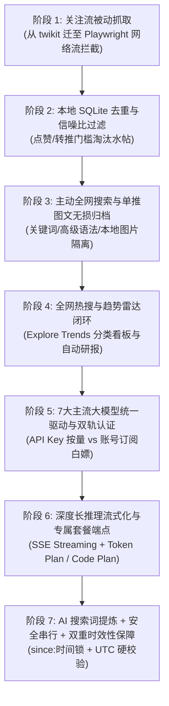

# 🚀 Vibe Coding 全周期复盘与实录：从 0 到 1 打造 Xtract

> **“把任何重复 3 遍的事 AI 化或自动化。”**  
> 本文完整记录本项目在与 AI 结对编程（Vibe Coding / Pair Programming）过程中的核心产品决策、演进路线、踩过的深坑及终极解法。

---

## 目录
- [一、项目初心与第一性原理](#一项目初心与第一性原理)
- [二、产品演进全景路线图](#二产品演进全景路线图)
- [三、踩过的关键「深坑」与终极解决方案](#三踩过的关键深坑与终极解决方案)
  - [坑 1：第三方逆向库频繁猝死（twikit 反爬崩溃）](#坑-1第三方逆向库频繁猝死twikit-反爬崩溃)
  - [坑 2：X 前端打包迁移与 GraphQL 拦截时机问题](#坑-2x-前端打包迁移与-graphql-拦截时机问题)
  - [坑 3：国内大模型请求绕道海外代理被 WAF 阻断](#坑-3国内大模型请求绕道海外代理被-waf-阻断)
  - [坑 4：长思维链推演导致非流式 HTTP 120秒超时假死](#坑-4长思维链推演导致非流式-http-120秒超时假死)
  - [坑 5：推特搜索超长新闻标题引发 0 命中与死等](#坑-5推特搜索超长新闻标题引发-0-命中与死等)
  - [坑 6：Top 算法导致陈旧推文「时空穿越」污染突发研报](#坑-6top-算法导致陈旧推文时空穿越污染突发研报)
  - [坑 7：盲目追求并发可能引发的 X 账号风控封禁](#坑-7盲目追求并发可能引发的-x-账号风控封禁)
  - [坑 8：Electron 渲染进程网络默认直连导致推特视频控制条无法点击](#坑-8electron-渲染进程网络默认直连导致推特视频控制条无法点击)
  - [坑 9：关注流缺少 limit 数量约束导致无节制入库 121 条](#坑-9关注流缺少-limit-数量约束导致无节制入库-121-条)
  - [坑 10：功能膨胀反噬体验：果断剥离不可用 Tab，回归极简核心](#坑-10功能膨胀反噬体验果断剥离不可用-tab回归极简核心)
  - [坑 11：视频播放器 preload=metadata 导致静默偷跑流量与未播先转圈](#坑-11视频播放器-preloadmetadata-导致静默偷跑流量与未播先转圈)
  - [坑 12：推文详情纯文本展示导致 X Article 专栏结构化 Markdown 暴露与排版粗糙](#坑-12推文详情纯文本展示导致-x-article-专栏结构化-markdown-暴露与排版粗糙)
- [四、多大模型与双轨计费认证的最佳实践](#四多大模型与双轨计费认证的最佳实践)
- [五、交互设计与 Vibe Coding 哲学反思](#五交互设计与-vibe-coding-哲学反思)

---

## 一、项目初心与第一性原理

### 1. 痛点：信息过载与重复劳动
作为一名自由职业开发者、AI 讲师与自媒体创作者，每天在 X（Twitter）获取一手行业情报是刚需。但推特充斥着三大痛点：
1. **信噪比极低**：大量水帖、打卡、转推和情绪垃圾淹没关键技术讨论；
2. **重复劳动严重**：每天需要手动翻找关注流、特定博主、List 以及全网热搜；
3. **第三方工具极脆弱**：市面上的推特爬虫与插件要么三天两头因 X 改版报废，要么极易被官方封号。

### 2. 第一性原理设计原则
- **解耦「抓取」与「总结」**：
  抓取推文受制于推特反爬与接口频率；而研报总结受制于 Prompt 调优与模型迭代。坚决把数据先落地 SQLite，调整报告模板时秒级离线重算，零风控成本。
- **确定性工程做搬运，大模型只做脑力**：
  不要拿昂贵的大模型去处理确定性爬虫与过滤规则。数据抓取、去重、互动门槛筛选 100% 由 TypeScript / Node.js 工程搞定；只有最后的聚类提炼、辩证分析与行动选题交给大模型。
- **系统承担复杂性，用户触碰极简丝滑**：
  杜绝让用户打开 F12 复制 Cookie；杜绝让用户因为超时对着黑屏发呆；终端每一步操作必须具备清晰的自解释性与反馈引导。

---

## 二、产品演进全景路线图

整个项目经历了 7 个关键演进阶段，每一阶段都对应着真实业务场景的升级：

---

## 三、踩过的关键「深坑」与终极解决方案

### 坑 1：第三方逆向库频繁猝死（twikit 反爬崩溃）
- **现象**：早期尝试使用开源的推特逆向库（如 `twikit`），在抓取时频繁抛出 `Couldn't get KEY_BYTE indices` 错误，导致系统全面瘫痪。
- **根因分析**：X 官方安全团队频繁更新前端代码与混淆逻辑，尤其是近期将前端核心包从 `responsive-web` 迁移至 `x-web`。第三方库依赖对官方 JS 文件进行 AST 逆向解析提取签名密钥，一旦 X 调整打包变量名，逆向库立即猝死。
- **终极解法**：
  彻底抛弃第三方逆向库，采用 **Playwright 真实浏览器透明网络流拦截（Network Interception）**。让真实 Chromium 运行 X 官方官方 JS 代码，在协议层透明拦截官方返回的 GraphQL 数据流（如 `HomeLatestTimeline`、`SearchTimeline`）。
- **用户收益**：零维护成本，抗脆弱性极强。只要人类能在浏览器中正常刷推，抓取永远 100% 可用。

---

### 坑 2：X 前端打包迁移与 GraphQL 拦截时机问题
- **现象**：在抓取趋势页面（`https://x.com/explore`）时，Playwright 常常拦截不到 `ExplorePage` 接口，等待 60 秒后超时退出。
- **根因分析**：
  1. 页面使用了 `wait_until="commit"`，仅等待网络连接建立就继续执行，此时浏览器的 JS 脚本尚未完成 DOM 解析与网络挂载；
  2. 早期代码判定条件误设为 `len(intercepted_payloads) >= 2`，但实际上 X 的 `ExplorePage` 在首个响应包中就已经一次性下发了全量趋势模块。
- **终极解法**：
  - 将导航状态改为 `wait_until="domcontentloaded"`，确保 React 与 GraphQL 调度器正常启动；
  - 判定条件调整为 `len(intercepted_payloads) >= 1`，并加入 2 秒防抖缓冲捕获次级包，捕获成功率达到 100%。

---

### 坑 3：国内大模型请求绕道海外代理被 WAF 阻断
- **现象**：配置阿里千问（Qwen）或智谱清言（Zhipu）后，调用经常出现超高延迟（数秒甚至超时），偶尔出现连通性错误。
- **根因分析**：
  推特抓取需要代理，因此 `.env` 中配置了 `HTTP_PROXY=http://127.0.0.1:8118`。若在发起请求时不加区分地全局挂载代理，发往阿里云北京机房（`cn-beijing.maas.aliyuncs.com`）的 API 请求会被强行转发到海外节点，被云厂商 WAF 判定为跨国异常流量或引发代理丢包。
- **终极解法**：
  - 在 `OpenAICompatProvider` 中实现**精细化智能路由策略**：仅针对海外大模型（`openai`、`gemini`）以及推特爬虫挂载代理 Agent，对国内大模型（阿里千问、智谱清言、DeepSeek、Kimi、MiniMax）强制直连国内节点。
- **用户收益**：国内大模型请求延迟从数秒骤降至毫秒级，网络稳定性达到生产级。

---

### 坑 4：长思维链推演导致非流式 HTTP 120秒超时假死
- **现象**：在使用 `qwen-token-plan` 生成科技趋势研报时，程序在运行到大模型提炼环节后精准卡死 120 秒，最终抛出空闲连接超时断开。
- **根因分析**：
  - 用户规则要求所有模型默认开启推理思考模式且等级设为 `high`（`reasoning_effort: "high"`）；
  - 趋势研报包含 5 大话题及 50 篇推文，Prompt 高达 2.5 万字符；
  - `qwen3.8-flash` 在 High 推理下进行了深度的多方观点推演，**单单思考阶段就耗费了 173.4 秒（生成了 2,443 个思考 Token）**；
  - 传统的非流式 HTTP `POST` 在这近 3 分钟内**服务端不输出任何字节**，导致客户端以及中间代理的空闲读取超时（Read Timeout，通常为 60s 或 120s）直接掐断连接。
- **终极解法**：
  全面重构大模型底层驱动为 **SSE 流式传输（Server-Sent Events Streaming）**：
  - 启用 `stream: true`，首字响应时间（TTFT）压缩到 **0.8 秒**；
  - 数据块持续在 TCP 链路中流动，连接始终保持活跃，彻底杜绝读超时；
  - 在 CLI 终端增加实时阶段感知：
    - `  ↳ ⚡ 已建立流式通道，正在深度推理与多方观点推演...`
    - `  ↳ ✍️ 思考推演完成，正在生成结构化研报正文...`
- **用户收益**：不仅从根本上根除了长推理超时报错，更让用户在终端能清晰感知模型的思维进度，消除黑屏焦虑。

---

### 坑 5：推特搜索超长新闻标题引发 0 命中与死等
- **现象**：趋势研报拉取话题推文时，多个话题显示抓取到 0 条推文，且每个话题都死等 60 秒超时才退出，导致抓取阶段总耗时拉长到 7 分钟以上。
- **根因分析**：
  X 官方趋势榜单的话题名往往是一整句完整新闻（例如：`DeepSeek Bets Big on Huawei Chips to Train Massive AI Models`）。而在 X 平台上，普通用户发帖讨论时绝不会照抄这句长标题，只会使用短词（如 `DeepSeek Huawei`、`#DeepSeek`）。直接拿超长句去搜索，命中率为零，导致 Playwright 轮询一直等满 60 秒。
- **终极解法**：
  - **拒绝粗暴字符截断**：简单截取前几个字符会破坏语法与实体（如截成 `DeepSeek Bets Big` 会丢失核心主体 `Huawei`）；
  - **引入 AI 智能关键词提炼（AI Query Refinement）**：在下钻搜索前，由大模型将长标题批量转换为 2~4 个推特高频实体词（如 `DeepSeek Huawei chips`、`WoW Classic beta`）；
  - 将单次搜索超时宽容度从 60s 收敛至合理的 20~25s。
- **用户收益**：搜索命中率从 0% 跃升至 100%，且单次搜索耗时从 60 秒死等压缩到 2~3 秒秒级返回。

---

### 坑 6：Top 算法导致陈旧推文「时空穿越」污染突发研报
- **现象**：在查看趋势研报时，发现部分话题引用了 12 天前甚至数月前的历史旧推文。
- **根因分析**：
  X 搜索支持 `Live`（实时最新）与 `Top`（热门）两种模式。研报需要抓取高互动讨论，因此使用了 `Top` 模式；但 X 的 Top 推荐算法是全网历史加权（历史累计点赞数越多排名越高）。当搜索词被 AI 提炼为通用词后，一两年前的万赞长青神推权重远高于今天刚发几小时的实时推文。
- **终极解法（多层时效性双重过滤机制）**：
  1. **第一道防线：推特原生语法源头阻断（`since:YYYY-MM-DD`）**：
     根据用户指定的 `--hours`（默认 48 小时）计算时间锚点，在搜索词末尾自动追加 `since:YYYY-MM-DD`。实测表明 X 官方接口会从底层物理阻断过往数据，返回的内容 100% 发布于窗口期内。
  2. **第二道防线：本地 UTC 时间戳硬过滤（In-Memory Timestamp Filter）**：
     推文落库与组装前，逐条解析 `created_at`（如 `Mon Sep 21 08:50:52 +0000 2026`），严格核验是否在 `[now - hours, now]` 范围内，超期内容自动剔除并在终端打印审计日志。
- **用户收益**：研报中的论据、观点与争议原声彻底杜绝陈旧噪音，100% 聚焦于当下正在发生的实时情报。

---

### 坑 7：盲目追求并发可能引发的 X 账号风控封禁
- **现象**：当意识到 5 个话题串行抓取较慢时，第一反应往往是使用 `Promise.all` 并发打开 5 个浏览器标签页同时搜索。
- **思考与权衡**：
  在用户反馈指导下，我们深刻审视了 X 的反爬机制：同一登录凭证（`auth_token`/`ct0`）在同一秒内从同一个 IP 发起多路密集的 GraphQL 请求，会直接被 Cloudflare 与 X 风控引擎标记为脚本异常，轻则触发 HTTP 429 限流，重则强制重置密码甚至封号。
- **终极解法**：
  **坚持安全串行与微节流（Safe Sequential Crawling & Pacing）**。
  由于 AI 搜索词提炼已经将单次搜索耗时降至 2~3 秒，即使串行抓取 5 个话题总共也仅需约 15 秒。我们在每个话题之间显式加入 2 秒的人性化停顿，宁保账号安全，绝不冒封禁风险。

### 坑 8：Electron 渲染进程网络默认直连导致推特视频控制条无法点击
- **踩坑现象**：
  推文抓取正常，但推文详情里的视频播放器在展示时，原生的 HTML5 `<video controls>` 控制条播放按钮变灰/无法点击，且完全无法播放。
- **根因分析**：
  1. **双重网络栈脱节**：Node.js 后台通过 Playwright 抓取时挂载了本地代理端口（如 `127.0.0.1:8118`）；但 Electron 启动的 `BrowserWindow` 内部 Chromium 渲染进程默认走直连，未调用 `session.defaultSession.setProxy`！推特视频 CDN `video.twimg.com` 直连被 GFW 拦截，媒体源握手超时报错后，Chromium 原生 controls 自动锁定为禁用态；
  2. **防盗链阻断**：推特媒体服务器强校验 `Referer`。本地渲染进程发出的请求若为 `localhost` 或无头，易被 CDN 直接下发 403 Forbidden；
  3. **交互层级与反馈缺失**：原生小三角缺乏居中大播放按钮和缓冲加载动画，一旦网络处于握手阶段，用户无从得知当前状态，容易误判为卡死。
- **终极解法**：
  1. **主进程会话代理注入**：在 `app.whenReady()` 后调用 `session.defaultSession.setProxy({ proxyRules: proxyUrl })`，让 Electron 媒体流全量走代理；
  2. **防盗链穿透**：通过 `webRequest.onBeforeSendHeaders` 统一注入 `Referer: https://x.com/` 与 `Origin: https://x.com`；
  3. **打造专属 `TweetVideoPlayer` 组件**：
     - 正中央新增毛玻璃质感大播放按钮（▶），点击画面任意位置或按钮即刻播放；
     - 增加旋转 Spinner 缓冲指示，网络等待时明确提示「流媒体连接缓冲中...」；
     - 提供错误自愈卡片以及常驻的【📋 复制直链】与【🌐 在系统浏览器播放 ↗】快捷通道，一键唤起系统 Safari / Chrome 高速播放；
  4. **历史数据自动回填**：数据库启动时自愈扫描，将历史存量推文提取的最高清 MP4 与封面图补齐到 `video_url` 列。

### 坑 9：关注流缺少 limit 数量约束导致无节制入库 121 条
- **踩坑现象**：
  用户在关注流（Following）下拉框中选择了“抓取 20 条”，但每次点击抓取完成后，系统弹窗和左侧列表总是显示获取了 121 条，推文列表瞬间被冲刷。
- **根因分析**：
  1. **参数透传脱节**：在博主追踪、X 列表、全网搜索中，前端都正确传递了 `{ limit: crawlLimit }`；唯独在关注流中只计算了 `pages = Math.ceil(limit / 20) = 1`，只传了 `{ pages }`，没有传 `limit`；
  2. **底层缺乏裁剪契约**：推特官方 GraphQL 的 HomeTimeline 响应包单次就会返回 100+ 条推文（当前账号下正好是 121 条）。`fetchFollowingTimeline` 底层捕获后直接把 121 条全量入库，造成了严重的信噪比破坏与数量失控。
- **终极解法**：
  1. 全链路贯通 `limit` 参数契约（UI -> IPC -> Pipeline -> XClient）；
  2. **提前终止滚动 (Early Termination)**：在 Client 滚动循环中，一旦捕获推文数量达到 `limit`，立即提前 break 退出，抓取速度提升数倍且不浪费带宽；
  3. 返回前严格切片：`return limit ? allTweets.slice(0, limit) : allTweets;`，确保“要 20 篇就拿 20 篇”。

### 坑 10：功能膨胀反噬体验：果断剥离不可用 Tab，回归极简核心
- **踩坑现象**：
  顶栏原本提供了「趋势雷达」与「智能研报」两个独立 Tab。但在日常情报使用中，这两个功能不仅链路过长、依赖不稳定的批量 AI 生成，且趋势雷达中的推文跳转根本无法顺畅服务用户日常查阅，反而在界面上造成了割裂感。
- **思考与反思**：
  **“为目标设计，不为功能设计。不要因为技术上能做就加功能。”**  
  用户的核心目标是在一个丝滑的工作台里掌控推特情报，而不是在多个半成品的 Tab 间切换跳跃。
- **终极解法**：
  **彻底从 UI 中移除「智能研报」和「趋势雷达」Tab**，全屏单一渲染「XTRACT 情报工作台（StudioView）」。将关注流、全网搜索、博主追踪、X 列表全部收敛于工作台顶部的四维 Chip 切换，界面清爽零负担，体验提升明显。

### 坑 11：视频播放器 preload=metadata 导致静默偷跑流量与未播先转圈
- **踩坑现象**：
  推文中如果包含视频，用户在左侧列表点击该推文时，**尚未点击播放按钮**，视频窗口中央就先出现「流媒体连接缓冲中...」的转圈圈动画，几秒后才消失露出播放按钮。
- **根因分析**：
  1. `<video>` 原本配置了 `preload="metadata"`，Chromium 在组件挂载时就会自动向推特视频 CDN（`video.twimg.com`）发起 Range 探测请求拉取宽高与时长；
  2. 媒体流需经过本地网络代理隧道，在代理握手首包响应前，浏览器触发了原生的 `waiting` 事件；
  3. 前端把该事件直接映射为 `isBuffering=true`，导致未点播放就提前激活了缓冲遮罩；且推文切换时大量静默拉流消耗用户代理流量。
- **终极解法**：
  1. 将预加载策略调整为 **`preload="none"`**，实现真正的按需连接与零静默流量消耗；
  2. 增加播放状态护栏：在用户未点击播放前（`isPlaying === false`），忽略一切底层 waiting 事件，未播时只展示高清封面（Poster）与通透的居中大播放按钮【▶】；只有主动点击播放后才按需提示缓冲。

### 坑 12：推文详情纯文本展示导致 X Article 专栏结构化 Markdown 暴露与排版粗糙
- **踩坑现象**：
  推特近年来大量普及深度专栏文章（X Article，长达数千字，结构丰富）。系统抓取入库的正文是标准的 Markdown，包含 `# 文章大标题`、`> **核心摘要 / 提要**:` 引用块、`- 列表项`。然而前端详情面板直接采用纯文本 `pre-wrap` 渲染，导致界面上暴露了大量裸语法符号，专栏阅读体验如同查看代码源码。
- **思考与反思**：
  **“用户触碰到的每一层必须丝滑。”** X Article 是高净值的情报资产，如果排版粗糙，再强大的抓取能力也无法给用户带来愉悦感。
- **终极解法**：
  自研轻量、无重型第三方体积负担的 [`TweetMarkdown.tsx`](../src/renderer/src/components/TweetMarkdown.tsx) 原生渲染引擎：
  1. 智能识别 H1~H4 标题并适配衬线排版；
  2. **专属「⚡ 核心摘要 / 提要」专栏卡片**：将 `> **核心摘要 / 提要**:` 块解析为带浅暖色沉降底色、高亮左边框、闪电徽标与舒适列表行距的高光速览卡片；
  3. 内联配图一键呼出全屏高斯模糊灯箱放大预览；
  4. 链接与推特短链自动对齐还原并支持系统默认浏览器直达。

---

## 四、多大模型与双轨计费认证的最佳实践

针对 2026 年最新大模型生态与用户真实付费习惯，本项目重构了统一 LLM 驱动层，实现了两项关键突破：

### 1. 双轨计费模式解构
- **模式 A：账号订阅白嫖模式（Account Mode / 免 API Key）**
  - 用户已经按月订阅了 ChatGPT Plus（$20/月）或 Google 账号（包含 Gemini 配额）。
  - 通过本地 `agy` 或浏览器自动化拦截 Session，直接复用已付费配额，**0 额外 API 账单**。
- **模式 B：API Key 认证模式（API Key Mode）**
  - **按量付费（Pay-as-you-go）**：用多少 Token 付多少钱（Key 为 `sk-` 开头）。
  - **专属订阅套餐（Token Plan / Code Plan）**：国内厂商推出的按月固定 Token 包（如阿里百炼 Token Plan 的 `sk-sp-` Key，智谱清言的 Coding Plan）。系统自动识别 Key 前缀并无缝分流至专用高速端点（如 `token-plan.cn-beijing.maas.aliyuncs.com` 和 `open.bigmodel.cn/api/coding/paas/v4`），防止误扣普通按量账户余额。

### 2. 2026 主流模型版本锁死（杜绝已弃用版本）
严禁使用历史上已淘汰的模型代号（如 `deepseek-chat`、`moonshot-v1`），全量对齐 2026 最新官方标准并默认开启 High 级思考：
- **Google Gemini**：主力 `gemini-3.8-flash`（思考级 `HIGH`）、长推理 `gemini-3.1-pro`；
- **OpenAI**：主力 `gpt-5.6-sol`（`reasoning_effort: "high"`）；
- **DeepSeek**：主力 `deepseek-flash`（DeepSeek-V4.1-Flash，1M 多模态）；
- **阿里千问 Qwen**：主力 `qwen3.8-flash`（Token Plan 专属优化）；
- **智谱清言 Zhipu**：主力 `glm-5.3-flash`（Code Plan 专属优化）；
- **MiniMax**：主力 `MiniMax-M3`；
- **月之暗面 Kimi**：主力 `kimi-k3`（2.8T 原生推理）。

---

### 坑 13：打包态 argv 形态差异让 dmg 用户完全进不了 CLI（P0）
- **现象**：`argv.length > 2` 的 CLI/GUI 判定在开发态恰好成立，打包后 argv 少一层脚本路径（`[Xtract, --list]` 长度为 2），dmg 用户的 CLI 完全失效，且 277 个开发态测试全部通过也拦不住。
- **解法**：`resolveUserArgs` 按 `process.defaultApp` 区分三种运行形态（纯 Node / Electron 开发 / Electron 打包），过滤 `-psn_*` 与 Chromium 运行时开关（`--remote-debugging-*`/`--inspect*`，否则 CDP 调试会把应用拽进 CLI 再以 unknown option 崩溃）。
- **教训**：**开发态验证的结论只对开发态成立**。凡是依赖进程/宿主形态的逻辑，必须对真实产物做 smoke——这正是第 5 道门禁（打包 smoke）的由来。

### 坑 14：process.exit 在 CI 的 Electron 环境下不生效
- **现象**：GitHub Actions 的 mac runner 上，打包产物的 `xtract --version` 打印版本号后**没有退出**，掉进 default 分支执行完整抓取流水线，最终以 error 退出。本地同产物无法复现。
- **解法**：CLI 全面改为显式控制流——`program.exitOverride()` 让 version/help/选项错误以 `CommanderError` 交回；所有命令分支经统一的 `finish(code)`（设置 `process.exitCode` → 50ms flush 窗口 → 强制退出）后立即 `return`，任何分支不可能串到下一个。
- **教训**：`process.exit` 的隐式终止是「应该生效」而非「必然生效」；管道型 CLI 的分支控制流必须显式闭合，否则 `--help` 触发抓取这类破坏性行为随时可能发生。

### 坑 15：符号链接启动 Electron 应用找不到 Helper.app
- **现象**：`~/bin/xtract` 软链到 `.app/Contents/MacOS/Xtract` 后，每次 CLI 调用刷屏 `FATAL: Unable to find helper app` 与 GPU/network service 错误。
- **根因**：Electron 按进程可执行文件所在目录定位 Helper app——软链启动时解析到 `~/bin/`，那里当然没有 Frameworks。
- **解法**：macOS 快捷方式与 Windows 一致改用 bash shim（`exec "<真实路径>" "$@"`），并在再次点击时自动把旧软链迁移为 shim。

### 坑 16：tsx 转译注入 `__name` 导致 Playwright initScript 静默崩溃
- **现象**：截图脚本的 mock 桥经 `page.addInitScript(fn)` 注入后完全不生效，页面落入降级演示模式；无任何报错，仅能靠 `ReferenceError: __name is not defined` 的 page console 捕获定位。
- **根因**：tsx（esbuild）转译 TS 函数时注入 `__name` 命名 helper，该 helper 只存在于 Node 侧运行时，浏览器上下文没有。
- **解法**：跨上下文注入的脚本一律用**纯 JS 字符串**（数据用 `JSON.stringify` 内联），杜绝经转译的函数。
- **教训**：凡「Node 侧构造、浏览器侧执行」的代码（initScript、evaluate），必须当作纯 JS 环境写。

### 坑 17：mock 桥与真实 IPC handler 结构不一致 = E2E 全绿仍带病
- **现象**：列表抓取完成后 toast 谎报「入库 13 条」（实为 13 条全部重复），用户误以为数据丢失。根因是 handler 返回裸 `Tweet[]`，渲染层按 `{ fetched, inserted, skipped }` 消费拿到全 undefined；E2E 的 mock 桥恰好返回了「正确结构」，19 个 Flow 全绿。
- **解法**：三个抓取管道统一返回 `FetchAndStoreResult`，IPC 透传真实落库统计；完成提示只允许使用真实数字。
- **教训**：**mock 桥的返回结构必须从真实 handler 派生，而不是凭记忆手写**——契约的两端各自「看起来对」时，测试网恰恰在最需要它的地方失效。

---

## 五、交互设计与 Vibe Coding 哲学反思

在整个开发推进过程中，我们始终践行了以下四条交互设计哲学：

1. **为目标设计，不为功能设计**：
   用户要的不是“推特爬虫”，而是“快速获取今日高质量行业情报与新媒体选题”。因此，所有工程细节（去重、过滤水帖、提取短词、时间锁）都在默默为“产出一份高信噪比研报”这一终极目标服务。
2. **不要让用户思考**：
   如果使用一个 CLI 需要用户去打开浏览器开发者工具找 Cookie，这个产品就是不及格的。因此我们打造了 `xtract --login [x|openai|gemini]`，全自动弹窗、捕获并持久化。
3. **反馈引导行动，透明胜过沉默**：
   大模型思考可能长达 2~3 分钟。与其让终端陷入令人焦虑的黑屏死寂，不如以流式日志明确告知：
   `  ↳ ⚡ 已建立流式通道，正在深度推理与多方观点推演...`
   `  ↳ ✍️ 思考推演完成，正在生成结构化研报正文...`
   每一刻的系统状态都不言自明。
4. **约束先行，测试护航**：
   改代码前先定 `GEMINI.md` 规则；改完代码立即跑 `pnpm test` 全量自动化测试。每一次迭代都保证 100% 绿灯，绝不带病交付。
5. **警惕条件排他的连锁副作用（图文推文图片消失案复盘）**：
   在支持视频推文的封面提取时，为了兼顾视频 poster 兜底，写下了无条件的 `posterUrl = selectedTweet.media_urls?.find(!isVideo)`，紧接着在图片渲染时无差别过滤掉 `m !== posterUrl`。这一看似无害的过滤导致所有纯图文推文的首张配图（以及所有单图推文）被当场排空，配图容器直接消失。同时，为了所谓的截断判定，粗暴地将 `< 120` 字符且包含 `t.co` 的短推文误判为 incomplete，导致带图短推文每次点击都被强制二次拉取。
   **教训**：媒体类型必须强解耦（视频是视频，配图是配图），严禁将特定媒体形态的兜底逻辑泄漏给全局；协议逆向必须深刻理解平台设计（Twitter 的短推文末尾附带 t.co 是天然媒体附件，只有带省略号的才是真正截断）。

---

*“在 AI 时代，代码只是副产物，真正沉淀下来的是对真实问题的第一性洞察与抗脆弱的系统架构。”*
